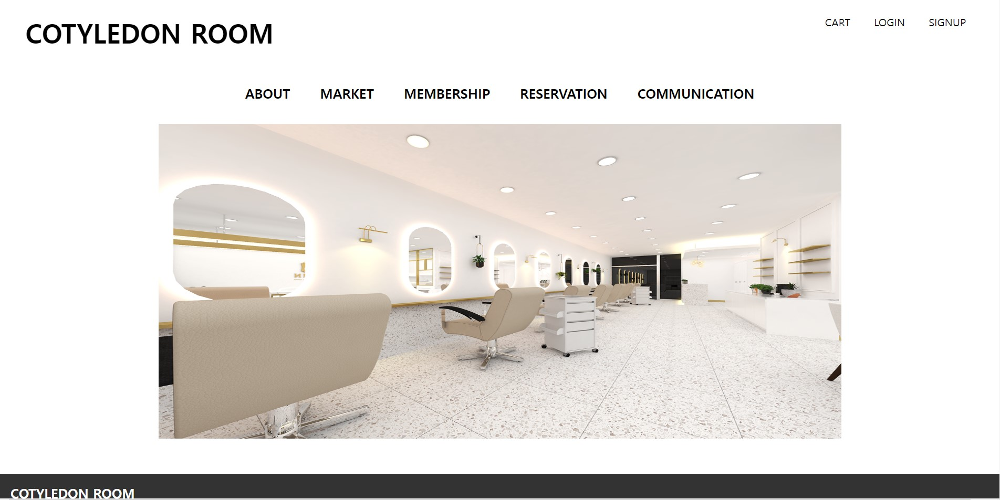
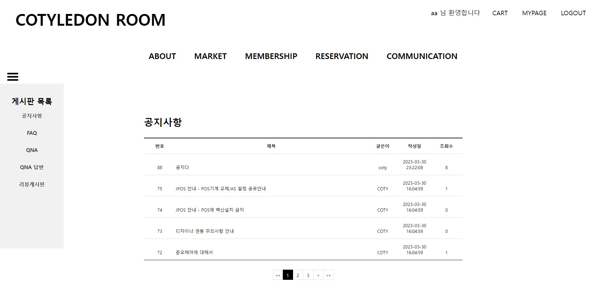
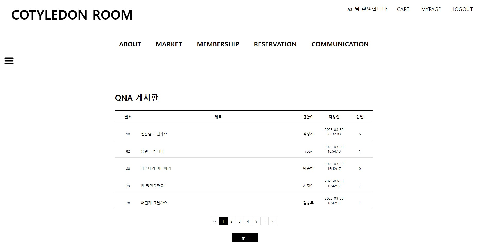
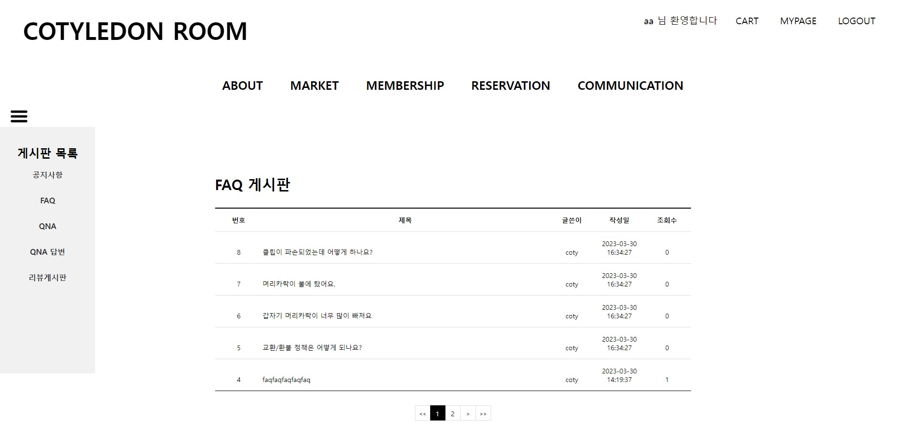

# Semi Project
> 첫번째 프로젝트 
> 이클립스로 작업하다 보니 매우 번거로운 작업이 많았지만 웹이 어떻게 구성되어 있는지 알 수 있는 매우 소중한 프로젝트

포트폴리오 링크 (<>)
 

## 맡은 파트
1.공지사항 
2.FAQ 
3.QNA
 
 
## 개발 환경
1.Eclipse 
2.Apache Tomcat 9.0
 
 
## 메인 페이지

 
 
## 공지사항
1. Total (<https://github.com/YEON-KIM/SemiPrj/tree/main/semiPrj/src/coty/admin/notice>)

 
 
## QNA
1. Controller (<https://github.com/YEON-KIM/SemiPrj/tree/main/semiPrj/src/coty/admin/qna/controller>)
2. Service (<https://github.com/YEON-KIM/SemiPrj/blob/main/semiPrj/src/coty/admin/qna/dvo/QNAService.java>)
3. Dao (<https://github.com/YEON-KIM/SemiPrj/blob/main/semiPrj/src/coty/admin/qna/dvo/QNA_a_Dao.java>)
4. Vo (<https://github.com/YEON-KIM/SemiPrj/blob/main/semiPrj/src/coty/admin/qna/dvo/QNA_a_Vo.java>)

 
 
## FAQ
1. Controller (<https://github.com/YEON-KIM/SemiPrj/tree/main/semiPrj/src/coty/admin/faq/controller>)
2. Service (<https://github.com/YEON-KIM/SemiPrj/blob/main/semiPrj/src/coty/admin/faq/dvo/FAQService.java>)
3. Dao (<https://github.com/YEON-KIM/SemiPrj/blob/main/semiPrj/src/coty/admin/faq/dvo/FAQ_a_Dao.java>)
4. Vo (<https://github.com/YEON-KIM/SemiPrj/blob/main/semiPrj/src/coty/admin/faq/dvo/FAQ_a_Vo.java>)

 
 

